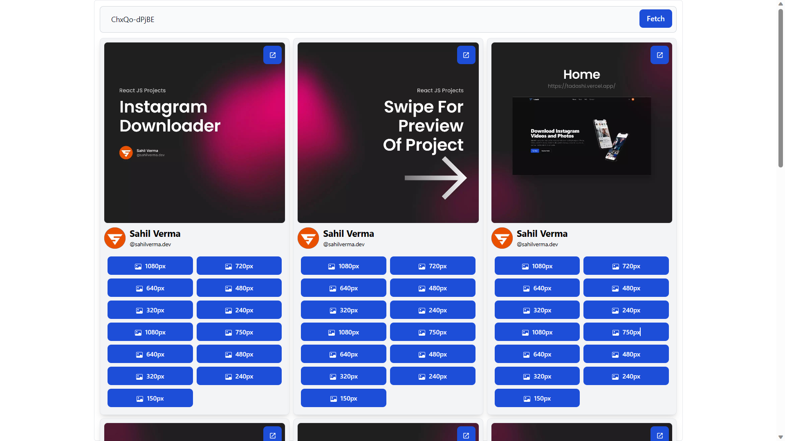

# Instagram Scrapping API

## Watch Full Video

https://youtu.be/DAgN7baFCkg

In this video, I'll be showing you how to create an Instagram Scraping API in Node.js. We'll focus on building the API component, and to keep things streamlined, we won't dive into the details of coding the frontend. However, I'll provide a working demonstration of the API so that you can see for yourself that it's functioning correctly. So let's dive right in!

## Disclaimer

This video is for educational purposes only. Please note that Instagram does not allow scraping their API, and doing so may violate their terms of service. This tutorial is intended to demonstrate the technical process of building an Instagram scraping API using Node.js and should not be used for any illegal or unauthorized activity.

## Screenshots

### Demo

## Installation

### Frontend

1. Navigate to the `frontend` folder
2. Install the dependencies by running `npm install`
3. Start the development server by running `npm run dev` or `vite`
4. The frontend will be available at `http://localhost:3000`

### Backend

2. Install the dependencies by running `npm install`
3. Create a `.env` file based on the `.env.example` file and set the appropriate environment variables
4. Start the server by running `npm run dev`
5. The backend will be available at `http://localhost:5000`

## Technologies

### Frontend

- React JS, Tailwind CSS
- Axios

### Backend

- Node JS
- Express JS
- Axios

## Contact

In case of any issues or for any other inquiries, please contact me at sahilverma.webdev@gmail.com
